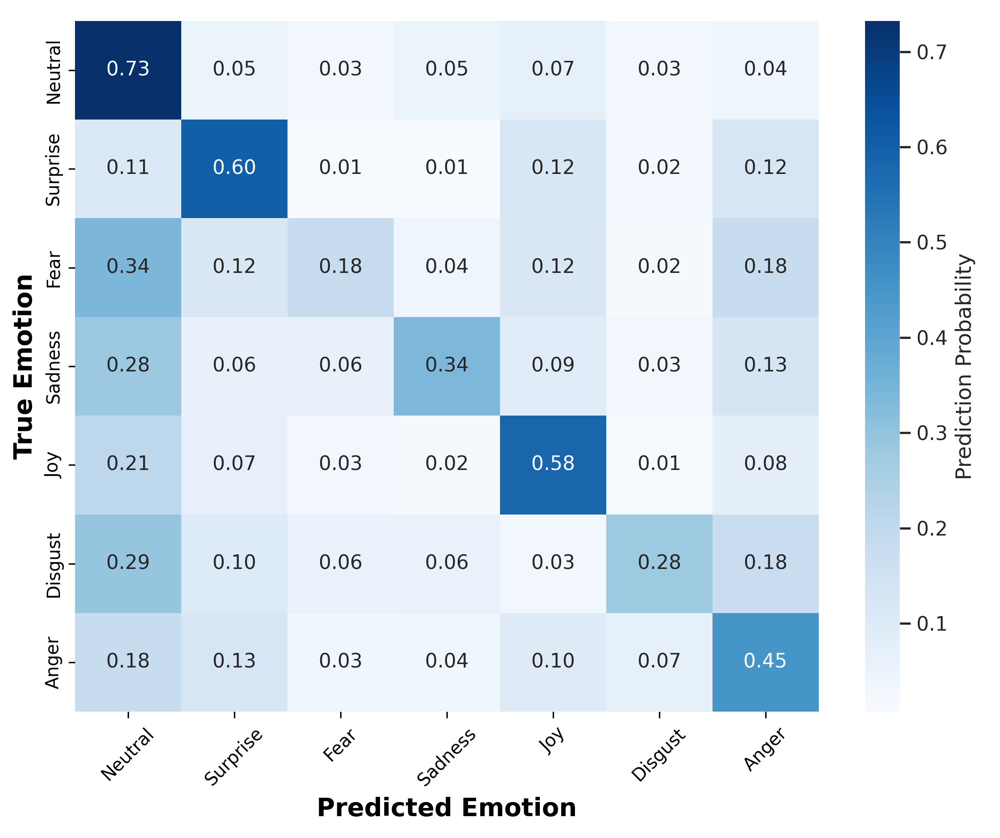
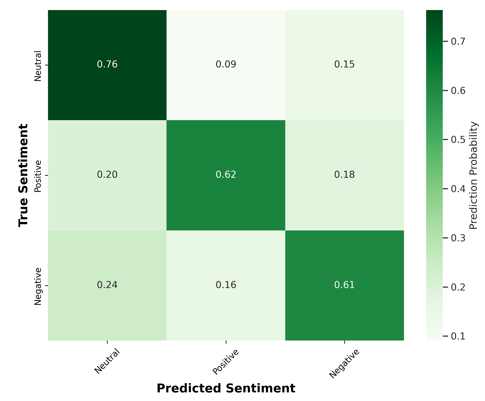

# DHGT: Parameter-Efficient Multimodal Emotion Recognition (14.5M)

**Architecture Whitepaper:** [Read the full conference-selected paper here](./docs/research_paper.pdf) for a deep-dive into the mathematical architecture.

## Overview

State-of-the-art Multimodal Emotion Recognition in Conversations (ERC) architectures typically require 130M+ trainable parameters and massive GPU clusters for end-to-end fine-tuning.

The **Decoupled Hierarchical Gated Transformer (DHGT)** is a highly compressed, 14.5M parameter fusion network designed for extreme parameter efficiency. By strictly decoupling feature extraction via frozen unimodal foundation models (DistilBERT, HuBERT, VideoMAE), DHGT shifts the computational burden away from the active training loop, allowing for robust cross-modal synthesis on consumer-grade hardware (**< 4GB VRAM**).

## Core Architectural Innovations

- **Disentangled Unimodal Compression (DUC):** A learnable low-rank bottleneck that acts as a non-linear PCA, filtering modality-specific noise from frozen foundation models prior to cross-modal attention.
- **Noise-Resistant Modality-Aware Encoding (NRME):** A dynamic gating mechanism that autonomously suppresses corrupted input modalities (e.g., off-camera speech or mic static) before final fusion.
- **SiLU-Activated SwiGLU Fusion:** Replaced standard GELU activations in the late-stage fusion MLP with SiLU to prevent gradient collapse on minority classes (Fear, Disgust) during highly skewed dataset training.

## Performance on MELD Dataset

Evaluated on the notoriously imbalanced Multimodal EmotionLines Dataset (MELD):

- **Emotion F-1 Score:** 60.79% (7-class)
- **Sentiment F-1 Score:** 69.32% (3-class)

### Overcoming the Validation Loss Paradox

Standard cross-entropy validation loss early-stopping causes catastrophic minority class collapse in skewed affective datasets. DHGT utilizes an **Uncertainty-Weighted Multi-Task Loss** with smoothed inverse-frequency penalties. As demonstrated below, training to completion rescues minority classes without destabilizing overall sentiment polarity.

<div style="display: flex; justify-content: space-between;">
  
  
</div>

## Repository Structure

```text
├── assets/                  # Rendered plots and matrices
├── docs/                    # IEEE Architectural Whitepaper
├── preprocess/              # Scripts for raw dataset extraction and preprocessing using feature extractors respective preprocessors
├── scripts/                 # Core execution loops (Train, Plot, Weights)
├── src/                     # DHGT Core Architecture (DUC, NRME, Fusion layers)
├── README.md
└── requirements.txt
```
